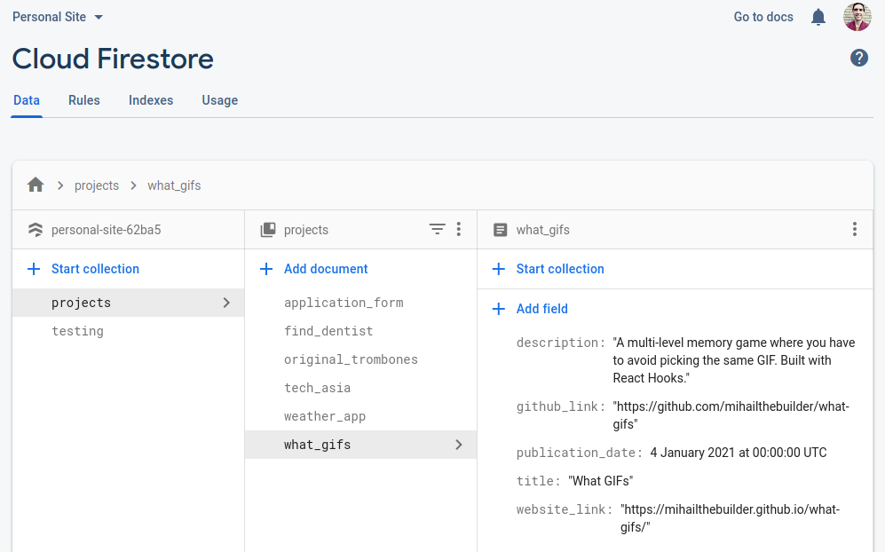
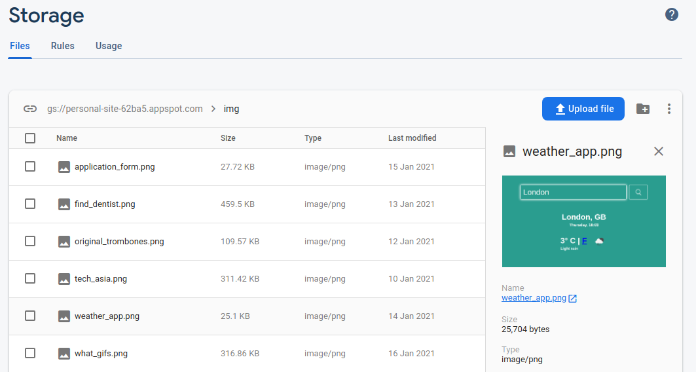
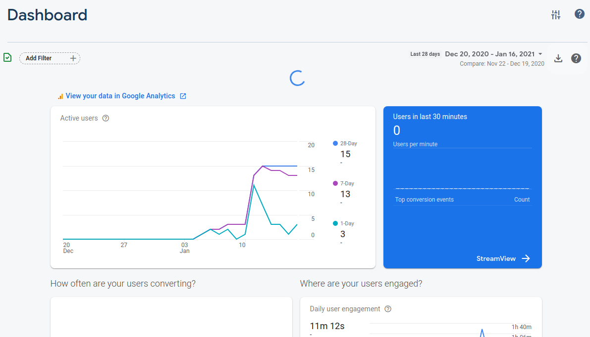
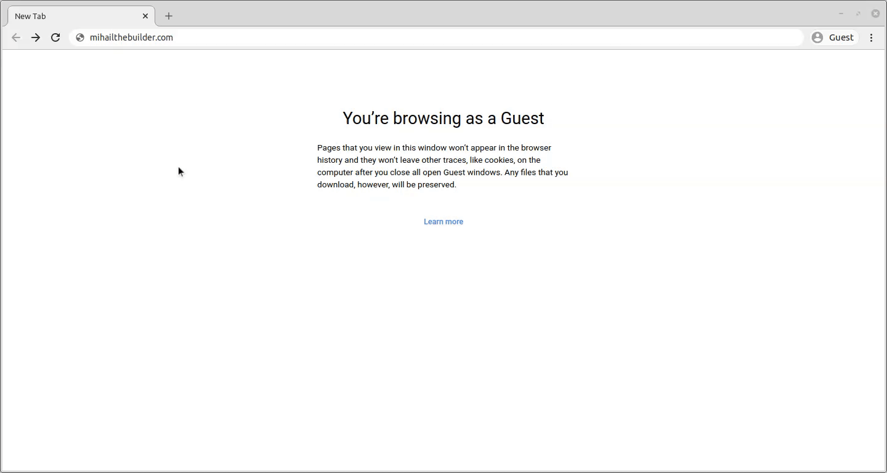
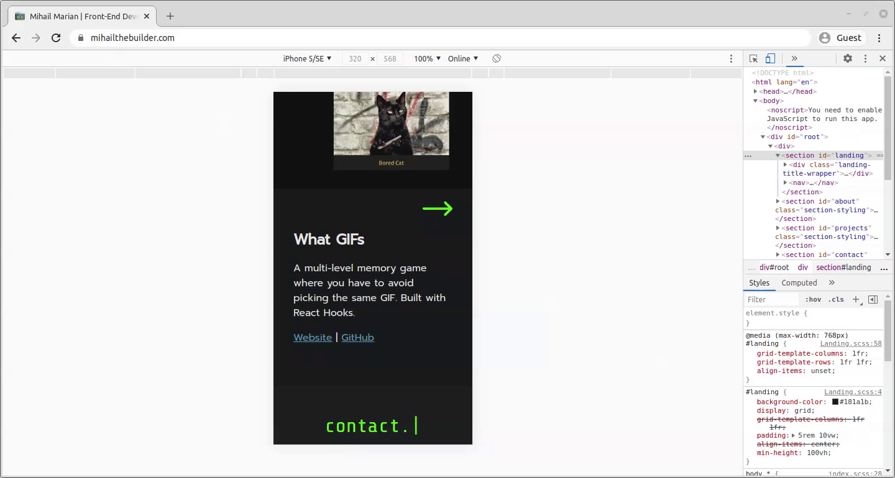

# Portfolio Site

My portfolio site. Made with a [React](https://reactjs.org/) front-end and [Firebase](https://www.firebase.com/) back-end.

# Table of Contents

- [Portfolio Site](#portfolio-site)
- [Table of Contents](#table-of-contents)
- [Firebase Setup](#firebase-setup)
  - [Cloud Firestore](#cloud-firestore)
  - [Cloud Storage](#cloud-storage)
  - [Google Analytics](#google-analytics)
- [Animations](#animations)
  - [Common structure](#common-structure)
    - [Visibility conditions](#visibility-conditions)
      - [1. Viewport fully contains the element](#1-viewport-fully-contains-the-element)
      - [2. Viewport partly contains the element and the element is greater than 1/3 of the viewport](#2-viewport-partly-contains-the-element-and-the-element-is-greater-than-13-of-the-viewport)
      - [3. Viewport is below the element](#3-viewport-is-below-the-element)
    - [Animation sequence](#animation-sequence)
  - [Special cases](#special-cases)
    - [Typewriter](#typewriter)
    - [Projects](#projects)
- [Responsive Design](#responsive-design)

# [Firebase](https://www.firebase.com/) Setup

I wanted to set up a back-end service that would act as the CMS for my projects. I picked Firebase because it's simple, robust, secure and it offers a free plan (very important for now :D). I am leveraging the following products from their suite:

## [Cloud Firestore](https://firebase.google.com/products/firestore)

A NoSQL database that enables me to store all the non-image data.



Each project is represented by a document inside the `projects` collection. All the data is loaded right after the [`Project`](src/components/Projects/index.jsx) component is mounted:

```js
const [projectList, setProjectList] = useState([]);
useEffect(() => {
  fire
    .firestore()
    //access the "projects" collection in firestore
    .collection("projects")
    //sort document objects by publication date in descending order
    .orderBy("publication_date", "desc")
    .get()
    .then((querySnapshot) => {
      //add the projects one by one to the projectList state
      let newProjectList = [];
      querySnapshot.forEach((doc) => {
        const project = {
          //include the document ID in projectList
          id: doc.id,
          ...doc.data(),
        };
        newProjectList = newProjectList.concat(project);
      });
      setProjectList(newProjectList);
    })
    .catch((error) => {
      console.log("Error getting project data", error);
    });
}, []);
```

The API for my database in publicly-accessible, so I've set up read-only access to avoid any tampering with the data.

## [Cloud Storage](https://firebase.google.com/products/storage)

Used to store content - in my case, it's screenshots of the websites I've built.



I send a request to its API every time a project is displayed in the [`Project`](src/components/Projects/index.jsx) component:

```jsx
// the data for the project displayed is in the focusProject state
const [focusProject, setFocusProject] = useState({
  id: "",
  image_src: "",
  description: "",
  title: "",
  website_link: "",
  github_link: "",
});
//projectIndex indicates which project in projectList is shown
const [projectIndex, setProjectIndex] = useState(0);

useEffect(() => {
  if (projectList.length > 0) {
    const project = projectList[projectIndex];

    //access Cloud Storage API
    fire
      .storage()
      .ref()
      //get the URL for the image
      .child(`img/${project.id}.png`)
      .getDownloadURL()
      .then((url) => {
        //add it to the focus project
        setFocusProject({ image_src: url, ...project });
      })
      .catch((error) => {
        console.log("Error getting image: ", error);
      });
  }
}, [projectIndex, projectList]);

//...code

return (
  //...code
  /* where the Cloud Storage API response data is used */
  
  //...code
);
```

As with [Cloud Firestore](#cloud-firestore), the API can be queried by anyone on the Internet so I set up read-only access.

## [Google Analytics](https://firebase.google.com/products/analytics)

It's incredibly easy to plug Google Analytics with Firebase. All I needed to run is this statement in [fire.js](./src/resources/fire.js):

```js
firebase.analytics();
```



# Animations

## Common structure

I created animations that made elements visible based on a common structure.

### Visibility conditions

To begin with, an element should only become visible under 3 conditions:

#### 1. Viewport fully contains the element

The default option. The landing page elements during the initial website load are a good example of this:



#### 2. Viewport partly contains the element and the element is greater than 1/3 of the viewport

This condition is most needed when loading images in mobile view.



Without it, users would have to scroll through a large blank area until the viewport covers the image.

#### 3. Viewport is below the element


I felt it would be the optimal user experience since the user would've already scrolled past that section so they wouldn't want to wait for it to load again.

These 3 visibility conditions are assessed in `isScrolledIntoView()` which is in [functions.js](./src/resources/functions.js)

```js
function isScrolledIntoView(el) {
  const rect = el.getBoundingClientRect();
  const elemTop = rect.top;
  const elemBottom = rect.bottom;

  const isVisible =
    //condition 3 - viewport below element
    elemBottom < 0 ||
    /*condition 2 - viewport partly contains element
    & element height > 1/3 of viewport height*/
    (elemBottom - elemTop > window.innerHeight / 3 &&
      elemTop < window.innerHeight) ||
    //condition 1 - viewport fully contains element
    (elemBottom - elemTop < window.innerHeight / 3 &&
      elemTop >= 0 &&
      elemBottom <= window.innerHeight);

  return isVisible;
}
```

### Animation sequence

Assuming all elements of section fulfil the [visibility conditions](#visibility-conditions) mentioned above, they should show up in a particular sequence. In order to address this, I created an `animationStep` state in each of the React components that generated an animation. Here's an example from the [Landing](./src/components/Landing/index.jsx) component:

```jsx
const Landing = ({ typewriterText, startAnimations }) => {
  const [animationStep, setAnimationStep] = useState(0);

  useEffect(() => {
    const animation = async () => {
      startAnimationFunction("#landing li:nth-of-type(1)", setAnimationStep);
      await sleep(200);
      startAnimationFunction("#landing li:nth-of-type(2)", setAnimationStep);
      await sleep(200);
      startAnimationFunction("#landing li:nth-of-type(3)", setAnimationStep);
    };

    if (startAnimations) {
      animation();
    }
  }, [startAnimations]);

  return (
    //code...

    // each of the <li> should appear in the set order
    <ul>
      <li className={animationStep < 1 ? "slide-out" : ""}>
        <a href="#about">ABOUT</a>
      </li>
      <li className={animationStep < 2 ? "slide-out" : ""}>
        <a href="#projects">PROJECTS</a>
      </li>
      <li className={animationStep < 3 ? "slide-out" : ""}>
        <a href="#contact">CONTACT</a>
      </li>
    </ul>
    //code...
  );
};
```

Looking at the `li` elements, you'll see that they have a `slide-out` class which hides them when it's not their turn to be shown.

The animation sequence and the visibility triggers are attached to the elements through the `startAnimationFunction` from [functions.js](./src/resources/functions.js):

```js
const startAnimationFunction = (elementSelector, setAnimationStep) => {
  const element = document.querySelector(elementSelector);
  //if visibility condition = true -> trigger next animation step
  if (isScrolledIntoView(element)) {
    setAnimationStep((previousValue) => previousValue + 1);
  } else {
    //if visiblity condition = true after scroll -> trigger next animation step
    //with a slight delay and remove this event listener
    window.addEventListener("scroll", function handler() {
      if (isScrolledIntoView(element)) {
        setTimeout(() => {
          setAnimationStep((previousValue) => previousValue + 1);
        }, 200);
        this.removeEventListener("scroll", handler);
      }
    });
  }
};
```

## Special cases

### [Typewriter](./src/components/Typewriter/index.jsx)

### Projects

# Responsive Design

```

```
